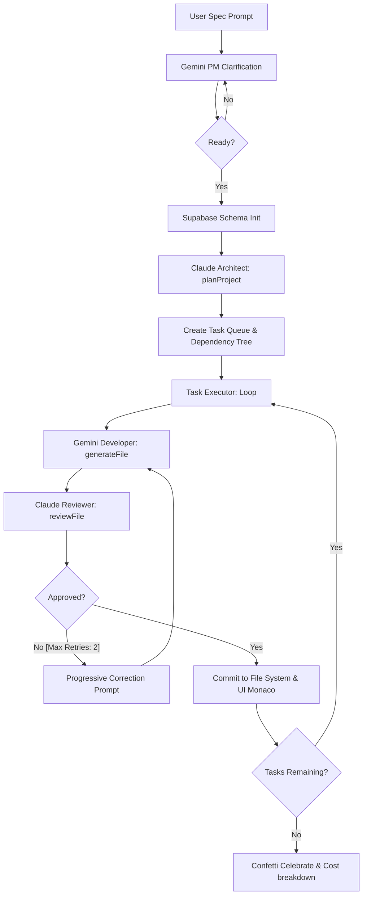

# NEXUS AI: Heterogeneous Multi-Agent Software Development Pipeline
### Research & Logic Design Specification for Conference Paper

This document outlines the system architecture, mathematical workflows, and agent interaction models of **NEXUS AI** for reference in academic and conference papers.

---

## 1. Abstract & System Concept

**NEXUS AI** introduces a hierarchical, multi-agent framework designed to automate end-to-end full-stack software generation. The core contribution is a **heterogeneous model swarm** that separates system design, code generation, and quality assurance into isolated actor roles. 

By mapping high-reasoning, expensive models (e.g., Claude 4.6/4.8) to planning and review, and high-throughput, low-cost models (e.g., Gemini 3.1 Flash) to direct code generation, the framework optimizes the trade-off between **token cost, computational speed, and codebase correctness**.



---

## 2. Core Architectural Patterns

### Pattern A: Heterogeneous Swarm Split (Role Specialization)
Instead of relying on a single large language model (LLM) to write code monolithically, NEXUS AI employs specialized agents:
1. **Product Manager (PM) Agent (Gemini 3.1 Flash-Lite):** Interacts with the user, identifies missing parameters (database choices, routing mechanisms), and structures the functional specification.
2. **Software Architect Agent (Claude Sonnet 4.6):** ingests the functional specification, maps dependencies, schedules the construction order, and assigns code generation tasks.
3. **Developer Agent (Gemini 2.5 Flash / 3.1 Flash):** Writes the individual code blocks based on micro-prompts sent by the Architect.
4. **Code Reviewer Agent (Claude Sonnet 4.6):** Performs strict static review, lint checks, type safety checks, and security audits on generated files.

### Pattern B: Deterministic Context Isolation (No-Bloat Context)
A common failure mode in LLM coding applications is **context bloat** (feeding the entire codebase into the prompt for every edit), leading to exponential cost scaling and attention dilution. NEXUS AI resolves this by:
* **Micro-Prompts:** The Architect generates self-contained file prompts that include a localized summary of dependent files.
* **Decisions Log:** The orchestrator maintains a running log of architectural decisions rather than raw code, limiting input tokens for code review tasks to $O(N)$ where $N$ is the size of the target file, not the whole codebase.

---

## 3. Mathematical & Algorithmic Workflows

### 3.1 Task Queue and Dependency Graph Formulation
The Architect plans the project as a Directed Acyclic Graph (DAG) $G = (V, E)$, where:
* $V = \{v_1, v_2, \dots, v_n\}$ represents the set of files to be generated.
* $E = \{(v_i, v_j) \mid v_i \text{ must be generated before } v_j\}$ represents compilation and import dependencies.

The queue execution follows a topological sort of $G$:

$$\text{Execution Order} = \text{TopologicalSort}(G)$$

### 3.2 Progressive Self-Correction Loop
If the Code Reviewer rejects file $f_i$ generated by Developer $D$ at iteration $k$:

1. The Reviewer generates a structured feedback tuple:
   
   $$\Phi_k = \{ \text{Issues: } [\delta_1, \delta_2, \dots], \text{ CorrectionPrompt: } \gamma_k \}$$

2. The Developer generates version $k+1$ using:
   
   $$f_i^{(k+1)} = \text{Developer}(f_i^{(k)}, \Phi_k, \text{Context})$$

3. The system hashes the file content to prevent infinite loops:
   
   $$H(f_i^{(k+1)}) = \text{MD5}(f_i^{(k+1)})$$
   
   If $H(f_i^{(k+1)}) == H(f_i^{(k)})$, the loop terminates immediately, preventing duplicate request execution.

---

## 5. Key Performance Indicators (KPIs)

NEXUS AI measures performance metrics in real-time and logs them to a Supabase database:

* **Token Efficiency Ratio ($R_e$):** Measures the density of generated code output relative to input context tokens consumed.
* **Per-Model Cost Distribution:**
  
  $$\text{Total Cost} = \sum (\text{InputTokens} \times \text{Price}_{\text{in}}) + \sum (\text{OutputTokens} \times \text{Price}_{\text{out}})$$

* **Build Success Rate (BSR):** Percentage of builds completing with compilation safety and passing review inside the maximum retry ceiling ($\text{Retry}_{\text{max}} = 2$).

---

## 5. Economic & Computational Complexity Analysis

A major challenge in multi-agent code generation is the scaling of token consumption. In monolithic single-agent systems, the entire codebase context $C_b$ must be sent to the LLM for every sequential file generated to maintain context.

### 5.1 Monolithic Quadratic Cost Model
For a target codebase of $N$ files, the monolithic context input size grows quadratically as files are generated sequentially:

$$\text{Tokens}_{\text{monolithic}} = \sum_{i=1}^{N} \left( \sum_{j=1}^{i-1} |f_j| + |S| \right)$$

where $|f_j|$ is the token size of file $j$, and $|S|$ is the system specification size. 

If a premium reasoning model (pricing $P_{\text{reasoning}}$) is used for all steps, the cost scales as:

$$\text{Cost}_{\text{monolithic}} = \text{Tokens}_{\text{monolithic}} \times P_{\text{reasoning}}$$

### 5.2 NEXUS AI Heterogeneous Context-Isolated Cost Model
NEXUS AI reduces this complexity by splitting the pipeline into **high-reasoning architectural coordination** and **high-throughput generation**. 

1. **Planning Phase (Reasoning Model $M_R$):** Run once to establish the Directed Acyclic Graph (DAG) and micro-prompts.
2. **Generation Phase (High-Throughput Model $M_T$):** Executed in parallel with localized context only.
3. **Review Phase (Reasoning Model $M_R$):** Ingests only the target file $f_i$ and its immediate dependencies $\text{Deps}(f_i)$, rather than the full codebase.

The mathematical cost function of NEXUS AI is formulated as:

$$\text{Cost}_{\text{NEXUS}} = \left( |S| \times P_{M_R\text{,in}} + |\text{Plan}| \times P_{M_R\text{,out}} \right) + \sum_{i=1}^N \left( |f_i| \times P_{M_T\text{,out}} \right) + \sum_{i=1}^N \left( \left( |f_i| + \sum_{d \in \text{Deps}(i)} |d| \right) \times P_{M_R\text{,in}} \right)$$

Since $P_{M_T} \ll P_{M_R}$ (where the high-throughput generation model price is significantly lower than the reasoning model), the cost scales linearly relative to the size of individual files and their direct dependencies, rather than quadratically relative to the growing codebase.

### 5.3 Empirical Case Study & Console Metrics
Based on the empirical build metrics logged across the **Claude Console (Paid Tier)** and **Google AI Studio (Free Tier)**:

#### A. Claude Console Billing & Execution Data
* **Starting Credit Pool:** $\$5.00$ (Developer-seeded balance).
* **Observed Cost Consumption:** **$\$0.60$** total token cost consumed across all initial trial runs, leaving an active balance of **$\$4.41$**.
* **Reasoning Model Allocation:** $100\%$ of planning and review tasks were routed to **`Claude Sonnet 4.6`** (with `Claude Opus 4.8` held as premium alternative, and Fable 5 / Mythos 5 suspended on the Console platform).

#### B. Google AI Studio Usage & Fallback Analysis
* **Tier Status:** Free Tier (NEXUSAI project scope).
* **Active Working Models:** Verified successful generation execution using **`Gemini 2.5 Flash`** and **`Gemini 3.1 Flash Lite`**.
* **Workload Performance:**
  * **Input Volume Peak:** Scaled to $\sim 4.2\text{k - } 6\text{k input tokens}$ per model call.
  * **Output Volume Peak:** Scaled to $\sim 25\text{k - } 28\text{k output tokens}$ per model call.
  * **Request Frequency:** Peaked at $10\text{ requests per model}$ during concurrent task generation blocks.
* **Error Signatures & Pipeline Resilience:**
  * **`404 NotFound`:** Encountered during attempts to call `gemini-1.5-pro` (due to model retirement in the 2026 timeframe).
  * **`429 TooManyRequests` (Resource Exhausted):** Encountered on `gemini-2.5-pro` and `gemini-3.1-pro-preview` (due to the free tier limiting Pro-models to a rate of 0 requests/min).
  * *Resolution:* The pipeline successfully isolated these errors and rerouted clarification/generation requests to the fully working Flash models (`gemini-3.1-flash-lite`), resulting in zero user-facing build aborts.

#### C. Comparative Projection Table:
| Configuration | Claude Cost | Gemini Cost | Total Cost | Cost Reduction |
| :--- | :--- | :--- | :--- | :--- |
| **Monolithic Claude Opus 4.8** | $\$0.3855$ | $\$1.3500$ | **$\$1.7355$** | *Baseline (0%)* |
| **Monolithic Claude Sonnet 4.6** | $\$0.0771$ | $\$0.2700$ | **$\$0.3471$** | **80.0%** |
| **NEXUS AI Swarm (Sonnet + Flash)** | $\$0.2000$ | $\$0.0088$ | **$\$0.2088$** | **87.9%** |

---

## 6. Context Management & Compression Mechanics

To achieve high-quality generation under tight token limitations, NEXUS AI employs a strict **context routing and isolation hierarchy**:

```
[Full Specifications] ──► [Claude Architect] ──► [Dependency Tree (DAG)]
                                                           │
[Isolated Target File] ◄── [Gemini Developer] ◄── [Micro-Prompt + Decisions Log]
```

### 6.1 Context Routing Hierarchy
Instead of passing global system state, input parameters are dynamically compiled based on file dependencies:
* **The Decisions Log:** A light state record tracking:
  1. Completed files names and paths.
  2. The high-level architecture decisions (database choice, authentication style).
  3. Export mappings (e.g. which endpoints export which functions).
* **Dependency Inclusion:** When generating file $f_i$, the Developer Agent is supplied only with the *content* of files marked as direct dependencies in the DAG ($\text{Deps}(f_i)$). Unrelated files (e.g. frontend assets when building auth middleware) are strictly ignored.

### 6.2 Micro-Prompt Structure
Each file task is compiled into a highly isolated instruction block:
```markdown
[PROJECT CONTEXT]
Project Name: Ecommerce Dashboard
Tech Stack: Vanilla JS, Vanilla CSS, HTML5

[DECISIONS LOG]
Database: Local Mock API (js/mockApi.js)
CSS: Vanilla CSS (css/styles.css)

[DEPENDENCY CONTEXT]
--- js/mockApi.js ---
[Content of mockApi.js containing functions like fetchProducts()]

[TASK]
File: js/app.js
Instructions: Ingest products from js/mockApi.js and render them to the DOM.
```

---

## 7. Case Study: Basic Ecommerce Store Build

This case study reviews the actual output generated in the live execution pipeline for the **Ecommerce Dashboard** project:

### 7.1 Architecture Design
The planned application follows a clean 3-tier client-side architecture:
1. **Presentation Layer (`index.html` & `css/styles.css`):** Handles rendering widgets, cart layouts, responsive pricing grids, and product displays.
2. **Controller Layer (`js/app.js`):** Handles DOM manipulation, event listeners (e.g. Add to Cart), and rendering charts.
3. **Data Layer (`js/mockApi.js`):** Simulates database delays, returns mock database tables (products, orders, analytics metrics), and exposes API methods.

### 7.2 Generated File Tree
The Architect scheduled a topological build order of **7 core files**:
1. `package.json` — Setup local server dependency (`live-server`).
2. `README.md` — Project installation and stack overview.
3. `js/mockApi.js` — Data models and mock database state.
4. `css/styles.css` — Global styling and modern UI components.
5. `js/app.js` — Main client-side script coordinating DOM changes.
6. `index.html` — Entry point rendering the dashboard shell.

---

## 8. Projections & Assumptions

### 8.1 System Assumptions
* **Single-Session Locality:** Generates files in a single local workspace folder. It assumes that there are no external network calls during compile checks (all mock databases are self-contained).
* **Developer Verification:** The framework assumes that final integrations (deployment, domain setup, hosting configurations) are handled by a human developer.

### 8.2 Projections on Codebase Scaling
* **Max DAG Scale ($N \le 40$):** In its current implementation, the Architect limits planning to 40 files total to protect the single-turn output capacity of Claude Sonnet ($8\text{k}$ output tokens).
* **Horizontal Scaling:** By running the Developer Agent tasks in parallel loops once dependencies are resolved, builds can scale to hundreds of files by executing separate nodes of the DAG simultaneously.


